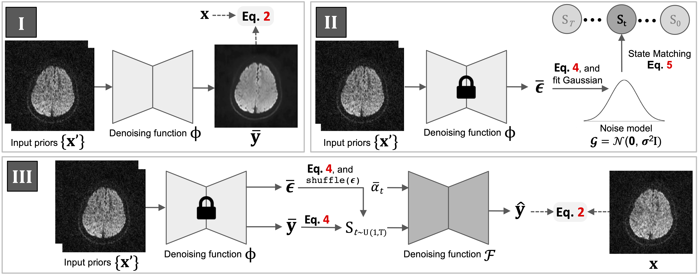

# DDM<sup>2</sup>: Self-Supervised Diffusion MRI Denoising with Generative Diffusion Models, ICLR 2023

Paper: https://arxiv.org/pdf/2302.03018.pdf




## Dependencies

Please clone our environment using the following command:

```
conda env create -f environment.yml  
conda activate DDM2
```

## Usage

### Data

For fair evaluations, we used the data provided in the [DIPY](https://dipy.org/) library. One can easily access their provided data (e.g. Sherbrooke and Stanford HARDI) by using their official loading script:  

```python3
hardi_fname, hardi_bval_fname, hardi_bvec_fname = get_fnames('stanford_hardi')
data, affine = load_nifti(hardi_fname)
```

### Configs

Different experiments are controlled by configuration files, which are in ```config/```. 

We have provided default training configurations for reproducing our experiments. Users are required to **change the path vairables** to their own directory/data before running any experiments. *More detailed guidances are provided as inline comments in the config files.*

### Train

The training of DDM<sup>2</sup> contains three sequential stages. For each stage, a corresponding config file (or an update of the original config file) need to be passed as a coommand line arg.

1. To train our Stage I:  
```python3 train_noise_model.py -p train -c config/hardi.json```  
or alternatively, modify ```run_stage1.sh``` and run:  
```./run_stage1.sh```  

2. After Stage I training completed, the path to the checkpoint of the noise model need to be specific at 'resume_state' of the 'noise_model' section in corresponding config file. Additionally, a file path (.txt) needs to be specified at 'initial_stage_file' in the 'noise_model' section. This file will be recorded with the matched states in Stage II.  

3. To process our Stage II:  
```python3 match_state.py -p train -c config/hardi.json```  
or alternatively, modify ```run_stage2.sh``` and run:  
```./run_stage2.sh```  

4. After Stage II finished, the state file (recorded in the previous step) needs to be specified at 'initial_stage_file' for both 'train' and 'val' in the 'datasets' section.  

5. To train our Stage III:  
```python3 train_diff_model.py -p train -c config/hardi.json```  
or alternatively, modify ```run_stage3.sh``` and run:  
```./run_stage3.sh```  

6. Validation results along with checkpoints will be saved in the ```/experiments``` folder.


### Inference (Denoise)

One can use the previously trained Stage III model to denoise a MRI dataset through:  
```python denoise.py -c config/hardi.json```  
or alternatively, modify ```denoise.sh``` and run:  
```./denoise.sh```   

The ```--save``` flag can be used to save the denoised reusults into a single '.nii.gz' file:  
```python denoise.py -c config/hardi.json --save```

## Citation  

If you find this repo useful in your work or research, please cite:  

```
@inproceedings{xiangddm,
  title={DDM $\^{} 2$: Self-Supervised Diffusion MRI Denoising with Generative Diffusion Models},
  author={Xiang, Tiange and Yurt, Mahmut and Syed, Ali B and Setsompop, Kawin and Chaudhari, Akshay},
  booktitle={The Eleventh International Conference on Learning Representations}
}
```
